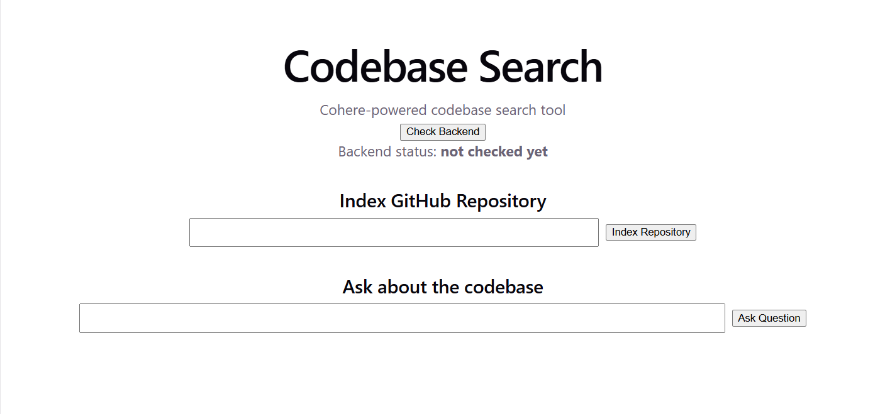

# Codebase Search
Codebase Search is a full-stack AI developer tool that helps users navigate GitHub repositories using natural-language questions.


A user can paste a public GitHub repository URL, index the codebase, and then ask questions related to the repository such as how specifc components are implemented, where certain flows exist, etc.

## Demo
Video: https://youtu.be/7qbb1oqNH-g


[](https://youtu.be/7qbb1oqNH-g)

## Features

- Index public GitHub repositories from a URL
- Filter and chunk source files with line-range metadata
- Generate code embeddings using Cohere Embed
- Retrieve relevant code chunks using hybrid semantic + keyword/code-symbol search
- Improve source relevance with Cohere Rerank
- Generate grounded answers using Cohere Command
- Display both Cohere-reranked chunks and raw hybrid retrieval results for comparison


## Flow
- Paste a public GitHub repository URL
- Click **Index Repository**
- Asl a question about the codebase
- Click **Ask Question**
- View: 
    - A generated answer
    - Cohere-reranked chunks
    - Raw hybrid retrieval results

## Setup
```
python -m venv venv
source venv/bin/activate
pip install -r requirements.txt

```

### Backend Setup:
From project root:
`cd backend`


Create a `.env` file, then add your Cohere API key
`COHERE_API_KEY = your_cohere_api_key_here`


Run the backend: `uvicorn app.main:app --reload`


Backend runs at: `http://127.0.0.1:8000`


FastAPI docs available at: `http://127.0.0.1:8000/docs`

### Frontend Setup:
In a separate terminal from project root:
```
cd frontend
npm install
npm run dev
```

Frontend runs at: `http://localhost:5173`

## Current Limitations/Working Improvements
- The app currently runs locally
- Only public GitHub repositories are supported
- Working on adding persistent storage for indexed repositories

## Rate Limit Notes
This project currently uses a Cohere trial key, which has rate limits. To reduce the likelihood of rate-limit errors, the backend limits repository size, chunks source files, filters out large files, and uses a small number of reranked chunks for answer generation.

If using a Cohere production key, the rate-limit backoff and indexing limits in `backend/app/pipeline.py` and `backend/app/config.py` can be adjusted.